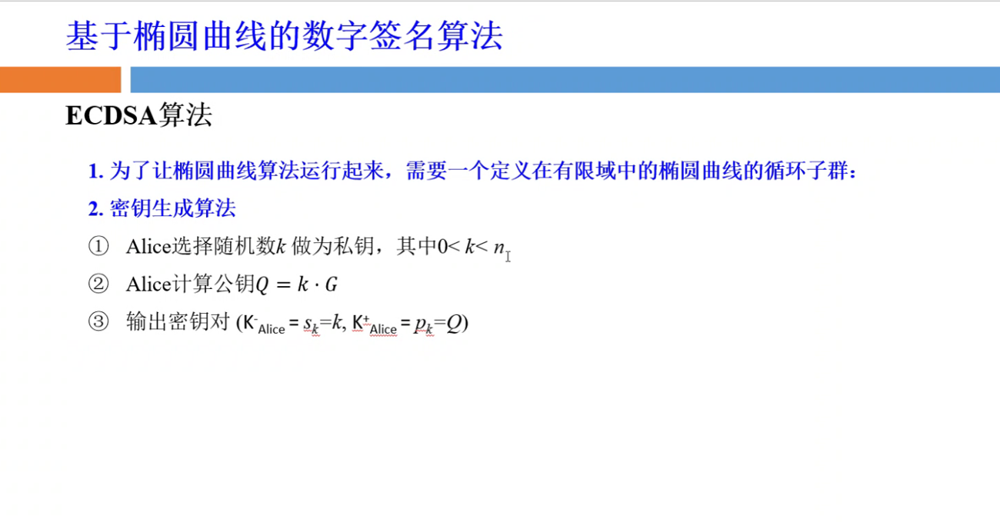
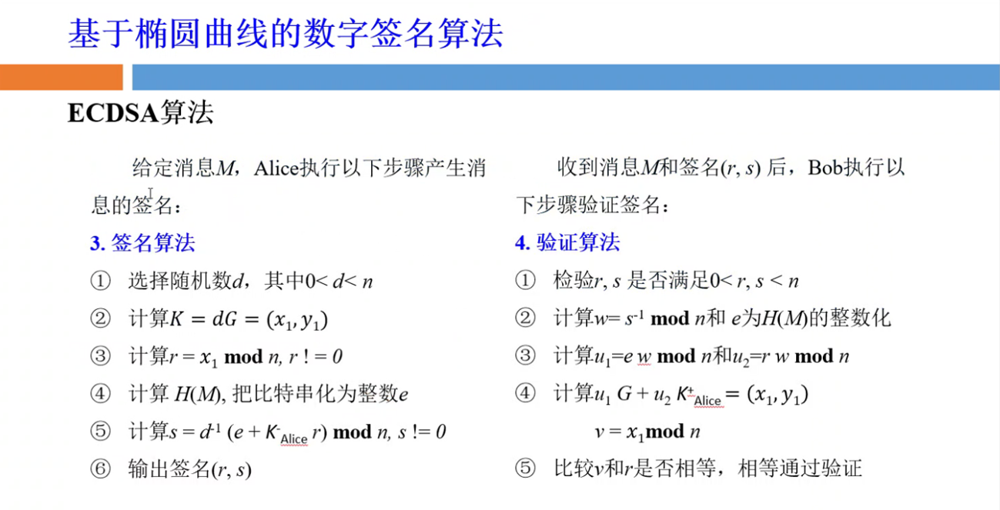
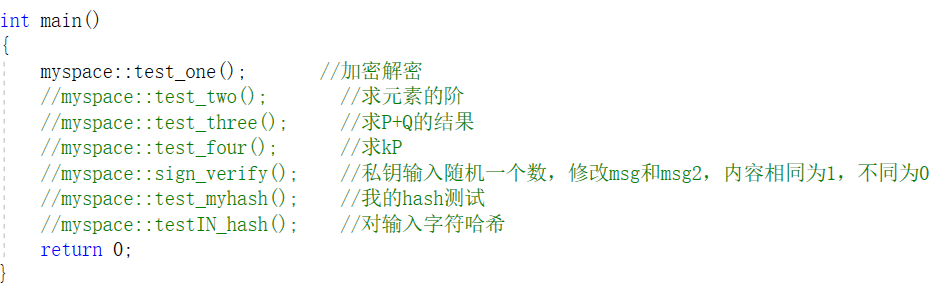
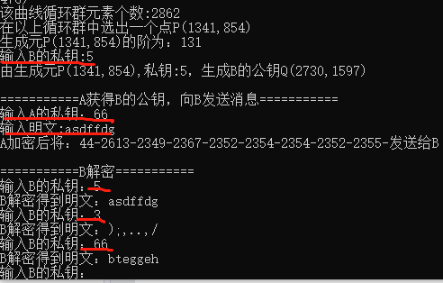
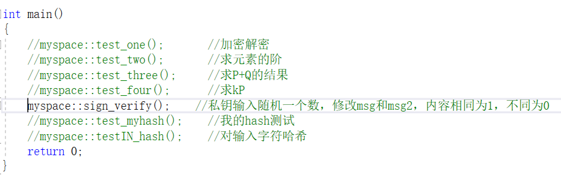
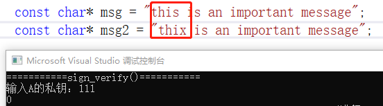
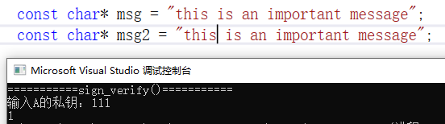

# Elliptic-Curve
#### ECC有限域椭圆曲线加密算法实例---构建椭圆曲线的循环群，利用椭圆曲线离散对数问题实现信息的加密解密,签名和验证

用C++实现一个简单的实例：A向B发送信息的加解密，签名和验证

通过有限域椭圆曲线构建一个循环群，利用椭圆曲线的离散对数问题实现对信息加解密，原理和实现参考链接：https://www.bilibili.com/video/BV1PP4y1M7Vk?spm_id_from=333.999.list.card_archive.click&vd_source=3535ff42ad6e2406310b6933e4f8b75e

签名和验证：

代码运行：

A利用B的公钥对明文加密发送给B,

B拿到密文后用B自己的私钥解密得到A发来的明文

对上面两条信息签名和验证：

A先对明文哈希，然后用自己的私钥对得到的哈希签名，把签名后的信息和A的公钥一起发送给B

B对密文解密得到明文，用A的公钥对明文验证，如果和A签名后的信息一样则返回1，否则返回0
